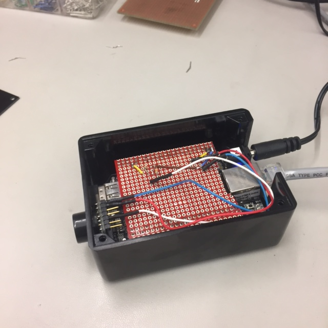

# Door Sensor

This is a proximity sensor connected to a BeagleBoneBlack that is designed to be placed on the inside of a doorway. When the sensor is tripped, the BBB will send a message to the DoorListener, which will in turn send a message to your desktop, alerting you that someone has entered your office.

## IP Address

In lines 14 and 17 of the DoorSensor.py code, change the IP address to the IP address of your computer. This is where the DoorSensor.py will send data and then alert you once someone has tripped the sensor.

## Automatic Startup

If you want to make it so that the code starts up automatically once it has power and runs presistently check out [Supervisord](https://www.digitalocean.com/community/tutorials/how-to-install-and-manage-supervisor-on-ubuntu-and-debian-vps).
